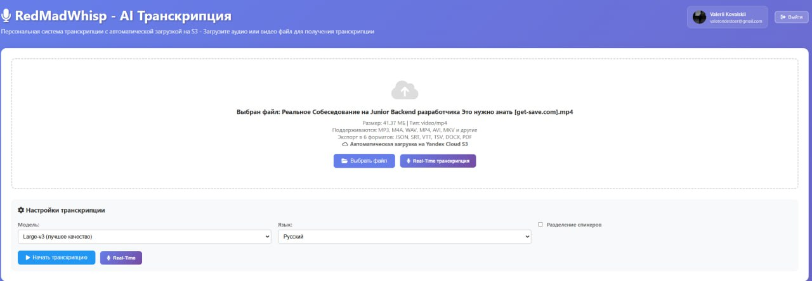
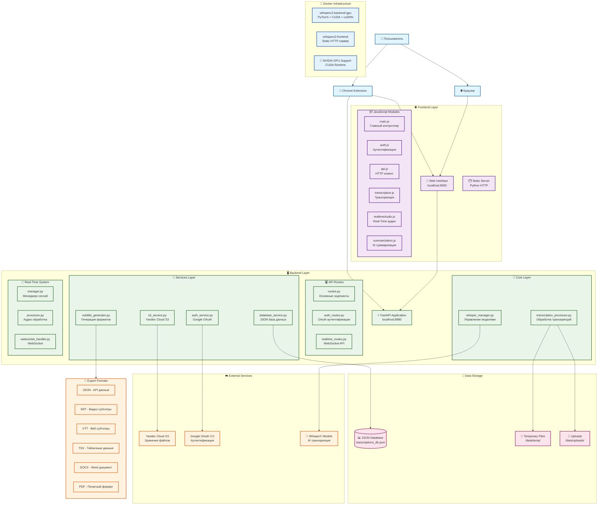

# whisperx-fronted-docker-compose - AI Транскрипция аудио и видео



<!-- Альтернативный способ с HTML: -->
<!--  -->

## ⚠️ ВАЖНО: Безопасность

**🔒 Перед развертыванием в продакшен:**
1. **Никогда не коммитьте файл `.env`** - он содержит секретные ключи
2. **Настройте переменные окружения** согласно [руководству по развертыванию](DEPLOYMENT.md)
3. **Смените все пароли и ключи** на продакшен-версии
4. **Настройте HTTPS** для безопасной передачи данных

📖 **Подробное руководство:** [DEPLOYMENT.md](DEPLOYMENT.md)

## 📋 Описание проекта

whisperx-fronted-docker-compose - это полнофункциональная система для транскрипции аудио и видео файлов, построенная на основе WhisperX с современным веб-интерфейсом, API, Chrome расширением и real-time транскрипцией. Система поддерживает экспорт в 6 различных форматов, автоматическую загрузку в Yandex Cloud S3, суммаризацию транскриптов и автоматическую очистку локальных файлов.

**Общая статистика проекта:** 16,437+ строк кода

## 🚀 Основные возможности

### 🎯 Транскрипция
- **Высокоточная транскрипция** аудио и видео файлов с использованием WhisperX
- **Разделение спикеров** (диаризация) с цветовой индикацией
- **Поддержка множества форматов**: MP3, M4A, WAV, MP4, AVI, MKV и другие
- **Выбор моделей**: Large-v3, Medium, Small для баланса качества и скорости
- **Мультиязычность**: Русский, English, автоопределение

### 📄 Экспорт и хранение
- **6 форматов экспорта**: JSON, SRT, VTT, TSV, DOCX, PDF
- **Автоматическая загрузка** результатов на Yandex Cloud S3
- **Организованное хранение** по категориям и форматам
- **Автоматическая очистка** локальных файлов после загрузки

### 🔄 Real-Time транскрипция
- **Живая транскрипция** с микрофона в реальном времени
- **WebSocket соединение** для низкой задержки
- **Визуальные индикаторы** уровня звука и статуса
- **Настраиваемые параметры** обработки

### 🤖 AI Суммаризация
- **Автоматическое создание** саммари транскриптов
- **Анализ спикеров** и их ключевых точек
- **Выделение важных моментов** с временными метками
- **Структурированное представление** результатов

### 🌐 Веб-интерфейс
- **Современный UI** с drag & drop функционалом
- **Встроенный медиаплеер** с синхронизацией транскрипта
- **История транскрипций** с поиском и фильтрацией
- **Адаптивный дизайн** для всех устройств

### 🔌 Chrome расширение
- **Запись встреч** прямо из браузера
- **Интеграция с вкладками** для захвата аудио
- **Микс микрофона и системного звука**
- **Автоматическая отправка** на сервер

### 🔐 Безопасность
- **Google OAuth 2.0** аутентификация
- **JWT токены** для авторизации
- **CORS защита** и безопасные заголовки
- **Шифрование данных** при передаче

## 🖥️ Интерфейс системы

### Главный интерфейс
Основной интерфейс whisperx-fronted-docker-compose включает:

- **Drag & Drop область** для загрузки файлов
- **Настройки транскрипции**: выбор модели, языка, включение диаризации
- **Медиаплеер** с синхронизацией транскрипта
- **Панель экспорта** с поддержкой 6 форматов
- **История транскрипций** с поиском и фильтрацией
- **Real-time транскрипция** с визуальными индикаторами
- **AI суммаризация** результатов

### Ключевые особенности UI
- 🎨 **Современный дизайн** с темной темой
- 📱 **Адаптивная верстка** для всех устройств
- 🎵 **Встроенный медиаплеер** с поддержкой аудио/видео
- 📊 **Визуализация прогресса** обработки
- 🔍 **Поиск и фильтрация** в истории
- 📋 **Копирование в буфер** одним кликом

## 📁 Структура проекта

```
whisperx-fronted-docker-compose/           # Корневая директория проекта
├── 📊 Статистика: 16,437+ строк кода
├── 
├── 🖥️ СЕРВЕРНАЯ ЧАСТЬ (Backend)
├── src/                                   # Основной код сервера (4,247 строк)
│   ├── main.py                           # FastAPI приложение (80 строк)
│   ├── 
│   ├── 🛣️ API слой
│   ├── api/                              # REST API эндпоинты (1,185 строк)
│   │   ├── routes.py                     # Основные маршруты (589 строк)
│   │   ├── realtime_routes.py            # Real-time WebSocket API (377 строк)
│   │   └── auth_routes.py                # Аутентификация OAuth (219 строк)
│   ├── 
│   ├── 🧠 Ядро системы
│   ├── core/                             # Основная логика (463 строки)
│   │   ├── whisper_manager.py            # Управление WhisperX моделями (102 строки)
│   │   └── transcription_processor.py    # Обработка транскрипций (361 строка)
│   ├── 
│   ├── 🔧 Сервисы
│   ├── services/                         # Бизнес-логика (1,066 строк)
│   │   ├── auth_service.py               # Google OAuth сервис (284 строки)
│   │   ├── database_service.py           # JSON база данных (227 строк)
│   │   ├── s3_service.py                 # Yandex Cloud S3 (149 строк)
│   │   └── subtitle_generator.py         # Генерация форматов (341 строка)
│   ├── 
│   ├── 🚀 Real-Time система
│   ├── realtime/                         # WebSocket транскрипция (1,162 строки)
│   │   ├── manager.py                    # Менеджер сессий (298 строк)
│   │   ├── processor.py                  # Обработка аудио потока (312 строк)
│   │   ├── websocket_handler.py          # WebSocket обработчик (387 строк)
│   │   └── models.py                     # Модели данных (165 строк)
│   ├── 
│   ├── ⚙️ Конфигурация и утилиты
│   ├── config/
│   │   └── settings.py                   # Настройки приложения (79 строк)
│   ├── models/
│   │   └── schemas.py                    # Pydantic схемы (91 строка)
│   ├── middleware/
│   │   └── auth_middleware.py            # Middleware аутентификации (54 строки)
│   └── utils/
│       └── time_formatters.py            # Форматировщики времени (25 строк)
├── 
├── 🌐 ВЕБ-ИНТЕРФЕЙС (Frontend)
├── web_interface/                        # Клиентская часть (9,247 строк)
│   ├── 📄 HTML страницы
│   ├── index.html                        # Главная страница (226 строк)
│   ├── login.html                        # Страница входа (280 строк)
│   ├── 
│   ├── 🎨 Стили
│   ├── style.css                         # Основные стили (1,988 строк)
│   ├── css/
│   │   └── realtime.css                  # Стили Real-Time UI (605 строк)
│   ├── 
│   ├── ⚙️ Конфигурация
│   ├── config.js                         # Настройки клиента (136 строк)
│   ├── config.example.js                 # Пример конфигурации (80 строк)
│   ├── debug_config.js                   # Отладочные настройки (24 строки)
│   ├── cache_version.js                  # Версионирование кеша (4 строки)
│   ├── 
│   ├── 📦 JavaScript модули
│   ├── modules/                          # Модульная архитектура (6,204 строки)
│   │   ├── main.js                       # Главный контроллер (640 строк)
│   │   ├── api.js                        # HTTP клиент (233 строки)
│   │   ├── auth.js                       # Система аутентификации (173 строки)
│   │   ├── ui.js                         # UI компоненты (337 строк)
│   │   ├── 
│   │   ├── 🎤 Транскрипция
│   │   ├── transcription.js              # Управление транскрипцией (355 строк)
│   │   ├── transcript.js                 # Отображение транскриптов (309 строк)
│   │   ├── 
│   │   ├── 🎵 Медиа
│   │   ├── mediaPlayer.js                # Аудио/видео плеер (375 строк)
│   │   ├── fileHandler.js                # Обработка файлов (171 строка)
│   │   ├── 
│   │   ├── 📊 Данные и история
│   │   ├── history.js                    # История транскрипций (524 строки)
│   │   ├── downloads.js                  # Управление загрузками (507 строк)
│   │   ├── summarization.js              # AI суммаризация (777 строк)
│   │   ├── 
│   │   └── 🔴 Real-Time
│   │       ├── realtimeAudio.js          # Аудио захват и обработка (562 строки)
│   │       ├── realtimeUI.js             # UI для real-time (694 строки)
│   │       └── audio-processor.js        # Аудио процессор (61 строка)
│   └── 
│   └── server.py                         # HTTP сервер для статики (68 строк)
├── 
├── 🔌 CHROME РАСШИРЕНИЕ
├── whisperx-fronted-docker-compose-extension/  # Браузерное расширение (2,943 строки)
│   ├── manifest.json                     # Манифест расширения (36 строк)
│   ├── 
│   ├── 🎯 Основные компоненты
│   ├── background.js                     # Service Worker (494 строки)
│   ├── popup.html                        # Интерфейс расширения (488 строк)
│   ├── popup.js                          # Логика popup (514 строк)
│   ├── 
│   ├── 🎙️ Аудио обработка
│   ├── offscreen.html                    # Offscreen документ (10 строк)
│   ├── offscreen.js                      # Аудио микширование (521 строка)
│   ├── 
│   ├── 🔐 Разрешения
│   ├── permission.html                   # Страница разрешений (96 строк)
│   ├── permission.js                     # Обработка разрешений (79 строк)
│   ├── 
│   ├── 📁 Ресурсы
│   ├── icons/                            # Иконки расширения
│   ├── README.md                         # Документация расширения (150 строк)
│   └── INSTALL.md                        # Инструкция по установке (64 строки)
├── 
├── 🐳 DOCKER И РАЗВЕРТЫВАНИЕ
├── Dockerfile                            # Backend контейнер (PyTorch + CUDA)
├── Dockerfile.frontend                   # Frontend контейнер
├── docker-compose.gpu.yml               # GPU конфигурация
├── docker-compose.dev.yml               # Development окружение
├── 
├── 🚀 СКРИПТЫ ЗАПУСКА
├── run.py                                # Запуск Backend + Frontend
├── server.py                             # Только API сервер
├── dev.py                                # Режим разработки
├── 
├── 📊 АНАЛИТИКА И УТИЛИТЫ
├── analyze_users_transcripts.py          # Анализ пользовательских данных
├── quick_stats.py                        # Быстрая статистика
├── generate_icons.py                     # Генерация иконок
├── 
├── 📋 КОНФИГУРАЦИЯ
├── requirements.txt                      # Python зависимости (45 пакетов)
├── data/
│   └── transcriptions_db.json            # JSON база данных
├── 
└── 📚 ДОКУМЕНТАЦИЯ
    ├── README.md                         # Основная документация
    ├── QUICKSTART.md                     # Быстрый старт
    ├── DOCKER_README.md                  # Docker инструкции
    ├── DOCKER_GPU_SETUP.md               # Настройка GPU
    ├── DOCKER_QUICK_START.md             # Быстрый запуск Docker
    ├── GOOGLE_OAUTH_SETUP.md             # Настройка OAuth
    ├── SECURITY_SETUP.md                 # Настройка безопасности
    ├── EXTENSION_QUICK_START.md          # Быстрый старт расширения
    ├── EXTENSION_DEVELOPMENT_PLAN.md     # План развития расширения
    ├── EXTENSION_TODO_PLAN.md            # TODO для расширения
    ├── REALTIME_DEVELOPMENT_PLAN.md      # План Real-Time функций
    └── TELEGRAM_POST.md                  # Пост для Telegram
```

## 🏗️ Архитектура системы

### 🔄 Диаграмма компонентов



## 🛠️ Технологический стек

### 🖥️ Backend (Python)
- **FastAPI** - современный веб-фреймворк
- **WhisperX** - AI модель транскрипции
- **Pydantic** - валидация данных
- **Uvicorn** - ASGI сервер
- **Google Auth** - OAuth 2.0 аутентификация
- **boto3** - AWS/Yandex Cloud SDK
- **WebSockets** - real-time коммуникация
- **python-docx & reportlab** - генерация документов

### 🌐 Frontend (JavaScript)
- **Vanilla JavaScript (ES6+)** - без фреймворков
- **HTML5** с семантической разметкой
- **CSS3** с современными возможностями
- **WebSocket API** - real-time соединения
- **Web Audio API** - обработка аудио
- **Модульная архитектура** - разделение ответственности

### 🔌 Chrome Extension
- **Manifest V3** - современный стандарт расширений
- **Service Workers** - фоновая обработка
- **Offscreen API** - аудио захват
- **Chrome APIs** - tabs, runtime, storage

### ☁️ Облачные сервисы
- **Yandex Cloud S3** - хранение файлов
- **Google OAuth 2.0** - аутентификация
- **JSON Database** - метаданные

### 🐳 DevOps
- **Docker** - контейнеризация
- **Docker Compose** - оркестрация
- **NVIDIA CUDA** - GPU ускорение
- **Nginx** - reverse proxy (опционально)

## 🚀 Быстрый запуск

### 📦 Установка зависимостей
```bash
# Клонирование репозитория
git clone <repository-url>
cd whisperx-fronted-docker-compose

# Создание виртуального окружения
python -m venv venv
source venv/bin/activate  # Linux/Mac
# или venv\Scripts\activate  # Windows

# Установка зависимостей
pip install -r requirements.txt
```

### ⚙️ Настройка окружения
```bash
# Копирование примера конфигурации
cp web_interface/config.example.js web_interface/config.js

# Настройка переменных окружения
export S3_ACCESS_KEY="your_s3_key"
export S3_SECRET_KEY="your_s3_secret"
export S3_BUCKET="your_bucket"
export GOOGLE_CLIENT_ID="your_google_client_id"
export GOOGLE_CLIENT_SECRET="your_google_client_secret"
export JWT_SECRET_KEY="your_jwt_secret"
```

### 🏃‍♂️ Запуск приложения

#### Простой запуск
```bash
# Backend + Frontend одновременно
python run.py

# Только API сервер
python server.py

# Режим разработки
python dev.py
```

#### Docker запуск
```bash
# Сборка образов
docker compose build

# Запуск с GPU поддержкой
docker compose -f docker-compose.yml -f docker-compose.gpu.yml up -d

# Проверка статуса
docker compose ps
```

### 🌐 Доступ к сервисам
- **Web Interface**: http://localhost:8000
- **Backend API**: http://localhost:8880
- **API Documentation**: http://localhost:8880/docs
- **Real-Time WebSocket**: ws://localhost:8880/ws/realtime

## 📚 Основные компоненты

### 🎯 Система транскрипции
**Файлы:** `src/core/transcription_processor.py`, `src/core/whisper_manager.py`

- Загрузка и управление WhisperX моделями
- Обработка аудио/видео файлов
- Диаризация спикеров
- Генерация временных меток
- Экспорт в множественные форматы

### 🔄 Real-Time транскрипция
**Файлы:** `src/realtime/`, `web_interface/modules/realtimeAudio.js`

- WebSocket соединения для низкой задержки
- Потоковая обработка аудио
- Управление сессиями пользователей
- Визуальная обратная связь

### 🤖 AI Суммаризация
**Файлы:** `web_interface/modules/summarization.js`

- Автоматический анализ транскриптов
- Выделение ключевых моментов
- Анализ спикеров и их вклада
- Структурированное представление

### 🔐 Система аутентификации
**Файлы:** `src/services/auth_service.py`, `src/api/auth_routes.py`

- Google OAuth 2.0 интеграция
- JWT токены для авторизации
- Middleware для защиты маршрутов
- Управление сессиями

### ☁️ Облачное хранение
**Файлы:** `src/services/s3_service.py`

- Автоматическая загрузка на Yandex Cloud S3
- Организация файлов по категориям
- Генерация безопасных ссылок
- Управление жизненным циклом файлов

### 🔌 Chrome расширение
**Файлы:** `whisperx-fronted-docker-compose-extension/`

- Запись встреч из браузера
- Микширование микрофона и системного звука
- Интеграция с веб-интерфейсом
- Управление разрешениями

## 📊 Форматы экспорта

| Формат | Описание | Использование |
|--------|----------|---------------|
| **JSON** | Структурированные данные с временными метками | API интеграция, разработка |
| **SRT** | Субтитры для видео | Видеоплееры, YouTube |
| **VTT** | Веб-субтитры | HTML5 видео, веб-плееры |
| **TSV** | Табличные данные | Excel, Google Sheets |
| **DOCX** | Документ Word | Редактирование, печать |
| **PDF** | Готовый к печати документ | Архивирование, презентации |

## 🔧 API Endpoints

### 🔐 Аутентификация
- `GET /api/auth/oauth/google` - Инициация OAuth
- `GET /api/auth/oauth/google/callback` - OAuth callback
- `POST /api/auth/refresh` - Обновление токена
- `GET /api/auth/user` - Информация о пользователе

### 🎤 Транскрипция
- `POST /api/upload` - Загрузка файла
- `GET /api/status/{task_id}` - Статус обработки
- `GET /api/s3-links/{task_id}` - Ссылки на результаты
- `DELETE /api/transcription/{task_id}` - Удаление транскрипции

### 📊 История и данные
- `GET /api/transcriptions` - История транскрипций
- `GET /api/transcription/{task_id}` - Конкретная транскрипция
- `POST /api/summarize/{task_id}` - Создание саммари

### 🔴 Real-Time
- `WebSocket /ws/realtime` - Real-time транскрипция
- `POST /api/realtime/session` - Создание сессии
- `DELETE /api/realtime/session/{session_id}` - Завершение сессии

## 🛡️ Безопасность

### 🔐 Аутентификация и авторизация
- Google OAuth 2.0 для безопасного входа
- JWT токены с истечением срока действия
- Refresh токены для продления сессий
- Middleware для защиты маршрутов

### 🌐 Веб-безопасность
- CORS настройки для разрешенных доменов
- CSP заголовки для предотвращения XSS
- Валидация всех входящих данных
- Безопасная обработка файлов

### ☁️ Облачная безопасность
- Шифрование при передаче данных
- Временные ссылки на файлы
- Автоматическая очистка временных данных
- Изоляция пользовательских данных

## 📈 Мониторинг и аналитика

### 📊 Встроенная аналитика
```bash
# Анализ пользовательских транскрипций
python analyze_users_transcripts.py

# Быстрая статистика системы
python quick_stats.py
```

### 📋 Логирование
- Структурированные логи FastAPI
- Отслеживание ошибок транскрипции
- Мониторинг производительности
- Аудит пользовательских действий

## 🔄 Обновления и развитие

### 📋 Планы развития
- **Улучшение AI моделей** - интеграция новых версий Whisper
- **Мультиязычность** - поддержка большего количества языков
- **Batch обработка** - загрузка множественных файлов
- **API v2** - расширенные возможности интеграции

### 🐛 Известные ограничения
- Максимальный размер файла: зависит от доступной памяти
- Real-time задержка: 100-500ms в зависимости от модели
- Поддержка браузеров: Chrome/Edge для расширения

## 🤝 Участие в разработке

### 📝 Структура коммитов
```
feat: добавление новой функции
fix: исправление ошибки
docs: обновление документации
style: изменения стилей
refactor: рефакторинг кода
test: добавление тестов
```

### 🔧 Локальная разработка
```bash
# Режим разработки с hot-reload
python dev.py

# Тестирование API
curl -X GET http://localhost:8880/docs

# Проверка стилей
# Используйте любой CSS/JS линтер
```

## ⭐ Поддержка проекта

Если проект оказался полезным, поставьте звезду на GitHub! ⭐

[](https://github.com/yourusername/whisperx-fronted-docker-compose)
[](https://github.com/yourusername/whisperx-fronted-docker-compose)
[](https://github.com/yourusername/whisperx-fronted-docker-compose/issues)
[](https://github.com/yourusername/whisperx-fronted-docker-compose/blob/main/LICENSE)

## 📄 Лицензия

Этот проект распространяется под лицензией MIT. Подробности в файле [LICENSE](LICENSE).

```
MIT License

Copyright (c) 2025 whisperx-fronted-docker-compose Contributors

Permission is hereby granted, free of charge, to any person obtaining a copy
of this software and associated documentation files (the "Software"), to deal
in the Software without restriction, including without limitation the rights
to use, copy, modify, merge, publish, distribute, sublicense, and/or sell
copies of the Software, and to permit persons to whom the Software is
furnished to do so, subject to the following conditions:

The above copyright notice and this permission notice shall be included in all
copies or substantial portions of the Software.

THE SOFTWARE IS PROVIDED "AS IS", WITHOUT WARRANTY OF ANY KIND, EXPRESS OR
IMPLIED, INCLUDING BUT NOT LIMITED TO THE WARRANTIES OF MERCHANTABILITY,
FITNESS FOR A PARTICULAR PURPOSE AND NONINFRINGEMENT. IN NO EVENT SHALL THE
AUTHORS OR COPYRIGHT HOLDERS BE LIABLE FOR ANY CLAIM, DAMAGES OR OTHER
LIABILITY, WHETHER IN AN ACTION OF CONTRACT, TORT OR OTHERWISE, ARISING FROM,
OUT OF OR IN CONNECTION WITH THE SOFTWARE OR THE USE OR OTHER DEALINGS IN THE
SOFTWARE.
```

---

**Проект whisperx-fronted-docker-compose** - современное решение для транскрипции с полным стеком технологий, готовое к продакшену и дальнейшему развитию.

*Последнее обновление: Январь 2025* 